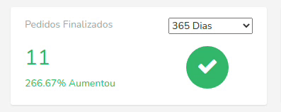

## What is metric?
Metrics is a PHP (Laravel) library to handle all the metrics in your application. It support a value metric and they allow to be loaded over AJAX with a nice loading animation.

It uses a simple API to create all the JS logic for you. You just need to write a few PHP lines :)



## Installation

You can pull in the package via composer:
``` bash
composer require jeanfprado/metrics
```

The package will automatically register itself.

## Configuration

### Laravel without auto-discovery:

If you don't use auto-discovery, add the MetricServiceProvider to the providers array in config/app.php

```php
Jeanfprado\Metric\MetricServiceProvider::class,
```

### Copy the package config to your local config with the publish command:

```bash
php artisan vendor:publish --provider="Jeanfprado\Metric\MetricServiceProvider"
```

## Creating a Metric

```bash
php artisan metric:value TotalUsers
```

Configure a new metric to use: `config/metrics.php`

```php
    'classes' => [
        App\Metrics\TotalUsers
    ],
```
Example Value Metrics
```php
<?php

namespace App\Metrics;

use App\User;
use Illuminate\Http\Request;
use Jeanfprado\Metric\Features\Value;

class TotalUsers extends Value
{
    /**
     * Calculate the value of the metric.
     *
     * @param  \Illuminate\Http\Request  $request
     * @return mixed
     */
    public function calculate(Request $request)
    {
        return $this->count($request, User::class,'created_at');
    }

    /**
     * Get the ranges available for the metric.
     *
     * @return array
     */
    public function ranges()
    {
        return [
            15 => __('15 Days'),
            30 => __('30 Days'),
            60 => __('60 Days'),
            365 => __('365 Days'),
            'TODAY' => __('Today'),
            'MTD' => __('Month To Date'),
            'QTD' => __('Quarter To Date'),
            'YTD' => __('Year To Date'),
        ];
    }

    /**
     * Determine for how many minutes the metric should be cached.
     *
     * @return  \DateTimeInterface|\DateInterval|float|int
     */
    public function cacheFor()
    {
        return now()->addMinutes(5);
    }

    /**
     * Get the URI key for the metric.
     *
     * @return string
     */
    public function uriKey()
    {
        return 'open-orders';
    }

    /**
     * Get a unique reference it's used to generate cache key
     *
     * @return string
     */
    protected function getUniqueReference()
    {
        return 'uuid';
    }
}

```

### Value Query Types

There are many type metrics. Let's explore each of them now.

#### Average
```php
    return $this->average($request, Order::class,'finished_count');
```
#### Sum
```php
    return $this->sum($request, Order::class,'price');
```
#### Max
```php
    return $this->max($request, Order::class,'amount');
```
#### Min
```php
    return $this->min($request, Order::class,'amount');
```

#### Custom Value
You also use a custom value.
```php
    return $this->result(Order::processed()->count());
```

### Render the script

You'll need to call the script() method contained in the metric to place the script tag. A full example is provided below.

```php
   {!! $chart->script() !!}
```
#### JS event and id

Sample HTML and all js id necessary to create a metric.

```html
   <!DOCTYPE html>
    <html>
        <head>
            <meta charset="utf-8">
            <title>Metric with API</title>
        </head>
        <body>
            <div id="{{ $metric->id }}_load"></div>
            <div id="{{ $metric->id }}_metric">
                <div id="{{ $metric->id }}_value"></div>
                <div id="{{ $metric->id }}_growth_percentage"></div>
                <select id="{{ $metric->id }}_select">
                    @foreach ($metric->ranges() as $range => $name)
                        <option value="{{ $range }}">{{ $name }}</option>
                    @endforeach
                </select>
            </div>
            {!! $metric->script() !!}
        </body>
    </html>
```

